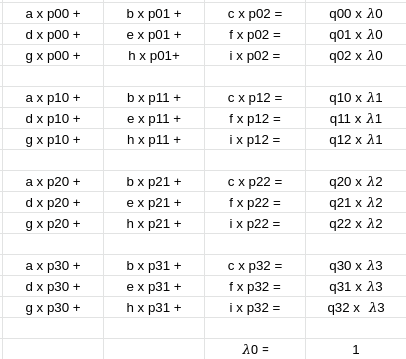

# Mapeamento projetivo de texturas - COMPUTACAO GRAFICA

## Teoria
Deseja-se realizar o mapeamento de uma imagem em outra com geometria projetiva, como mostra o diagrama
<p align="center">
  
</p>

Temos como entrada o destino e a textura:  
- Destino (p00, p01, p10, p11, p20, p21, p30, p31)
- Textura (q0 = (0,0); q1 = (0, h-1); p2 = (w-1, h-1); p3 = (w-1, 0))  

Assim precisamos resolver (com 𝜆0 = 1):
<p align="center">
  
</p>

Que resulta em:
<p align="center">
  
</p>

Organizando no sistema da tranformacao:
<p align="center">
  
</p>

Agora basta resolvermos para termos a transformação e com isso iterar pixel a pixel para verificar qual renderizar.

## Programa

O programa pode ser rodado com os comandos:   
```python project.py <path_textura> <path_original> <p0x> <p0y> <p1x> <p1y> <p2x> <p2y> <p3x> <p3y> [<output_path>]```   
levando em consideracao o sistema de referencias: 
<p align="center">
  
</p>
A imagem sera salva no output_path caso fornecido. Caso contrario, sera salva no diretorio de execucao com nome result.png   

Exemplo:   ```python project.py examples/possani.jpg examples/laptop_milico.jpg 96 87 199 76 252 202 158 240```   
Resultara em: 
<p align="center">
  
</p>